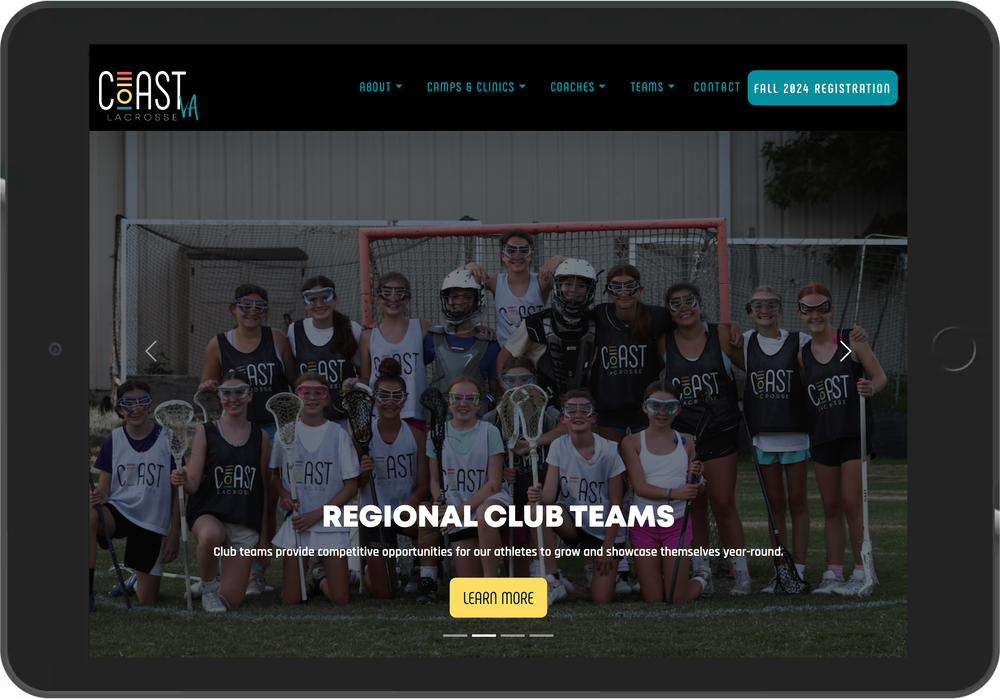
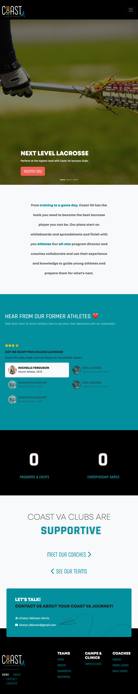

# Coast VA Website

## Table of Contents
- [Coast VA Website](#coast-va-website)
  - [Table of Contents](#table-of-contents)
  - [FEATURES](#features)
    - [Home](#home)
    - [About](#about)
    - [Teams](#teams)
    - [Camps \& Clinics](#camps--clinics)
  - [Data](#data)
      - [Updating Content](#updating-content)
    - [HOMEPAGE](#homepage)
    - [About Page](#about-page)
    - [TEAM PAGE](#team-page)
  - [Revisions](#revisions)
    - [HOMEPAGE](#homepage-1)
    - [ABOUT PAGE](#about-page-1)
    - [TEAM PAGE](#team-page-1)
    - [CAMPS \& CLINICS](#camps--clinics-1)
  - [Credits](#credits)
    - [Links](#links)

## FEATURES

### Home
- [x] Landing Page:
  - [x] Carousel Slider
  - [x] Testimonials
  - [x] Contact
  - [x] Navigation 

### About
- [x] About 
  - [x] About Coast VA
  - [x] FAQ

### Teams
- [x] Teams
  - [x] Practice Schdule
  - [x] Tournaments
  - [x] Teams
  
### Camps & Clinics
- [x] Camps and Clinics
  - [x] Training Points

## Data

#### Updating Content
- Custom scripts have been developed for this software to make the client experience as seamless as possible.
- The following technologies were used to crafts custom functionality for Coast VA:
  - JavaScript: Scripts written to automatically update website with data from corresponding data files.
  - Google Apps Scripts: Custom Google Apps scripts have been developed for Google spreadsheets containing website data. The scripts trigger GitHub Workflows to run, so the client can easily update website data without leaving Google Sheets.
  - GitHub Workflow files have been crafted using YAML to automate the process of flattening data, committing changes, and pushing changes to the master branch/live site.

### HOMEPAGE

    - Made it possible to edit Homepage Image Slider (Carousel)
    - https://drive.google.com/file/d/1T5i0dsvyMqUgb7-VUOG8Pizr5Y2SFnpO/view?usp=drive_link

### About Page
    - Editing About Section: https://drive.google.com/file/d/1vfZ5thiLqAYie4C6fsqCHac7Ebpq_RV8/view?usp=drive_link
    - Editing FAQ Section: https://drive.google.com/file/d/1Mk7VrDgQdc2Mu81w51oIGCxNlalttDIR/view?usp=drive_link

### TEAM PAGE 

- Reorganized Team tab to include: tournaments and practice schedule.
    - https://coastva.github.io/coast-va/teams.html#practice
    - Made it possible to update practice schedule from Google Sheets: https://drive.google.com/file/d/17g5xmAZaIYkch93Y3vu4dcQMSToOwPyB/view?usp=drive_link
    - Made it possible to update tournament schedule from Google Sheets: https://drive.google.com/file/d/15F_TOsaMriBFyZNE2ONMFnZsSVbkNu5q/view?usp=drive_link

Camps & Clinics

- Created new page for Camps & Clinics: 
    - https://coastva.github.io/coast-va/camps-and-clinics.html#campsAndClinics
    - https://coastva.github.io/coast-va/camps-and-clinics.html#trainingPoints
        - Made it possible for client to add/edit/delete Camp and Clinic Programs from data file: https://drive.google.com/file/d/1o38maGiqdcuN3ntFu2vgk5joHHHcBJrZ/view?usp=sharing
        - Made it possible for client to edit the Training Points via Google Sheets: https://drive.google.com/file/d/1SLHNGrIBHHQy5GZPEK19fahSs9J2rFKI/view?usp=sharing

## Revisions

### HOMEPAGE
- [x] Wrote Google App script, developed GitHub Workflow, and constructed new data file for Homepage Carousel, making it possible for client to edit carousel data (text, images, links) right from Google Sheets.
- [x] Created [Demo/Tutorial Video](https://drive.google.com/file/d/1T5i0dsvyMqUgb7-VUOG8Pizr5Y2SFnpO/view?usp=drive_link) showing client how to update homepage carousel slider.

### ABOUT PAGE
- [x] Wrote Google App script, developed GitHub Workflow, and constructed new data file for [About](https://coastva.github.io/coast-va/about.html) section on About Page, making it possible for client to edit About Page data (text and images) right from Google Sheets.
- [x] Created [Demo/Tutorial Video](https://drive.google.com/file/d/1vfZ5thiLqAYie4C6fsqCHac7Ebpq_RV8/view?usp=drive_link) showing client how to update About Page data
- [x] Wrote Google App script, developed GitHub Workflow, and constructed new data file for [FAQ](https://coastva.github.io/coast-va/about.html#faq) section on About Page, making it possible for client to edit About Page data (text and images) right from Google Sheets.
- [x] Created [Demo/Tutorial Video](https://drive.google.com/file/d/1Mk7VrDgQdc2Mu81w51oIGCxNlalttDIR/view?usp=drive_link) showing client how to update About Page data

### TEAM PAGE 

- [x] Reorganized Team tab to include: 
  - [x] [Tournaments](https://coastva.github.io/coast-va/teams.html#tournaments)
  - [x] [Practice](https://coastva.github.io/coast-va/teams.html#practice)
- [x] Created [Demo/Tutorial Video](https://drive.google.com/file/d/17g5xmAZaIYkch93Y3vu4dcQMSToOwPyB/view?usp=drive_link) showing client how to update Pratice schedule
- [x] Created [Demo/Tutorial Video](https://drive.google.com/file/d/15F_TOsaMriBFyZNE2ONMFnZsSVbkNu5q/view?usp=sharing) teaching client how to update Tournaments

### CAMPS & CLINICS

- [x] Created new page for [Camps & Clinics](https://coastva.github.io/coast-va/camps-and-clinics.html#campsAndClinics)
        - Created [video](https://drive.google.com/file/d/1o38maGiqdcuN3ntFu2vgk5joHHHcBJrZ/view?usp=sharing) demontrating how client can add/edit/delete Camp and Clinic Programs from data file. 
	    - Created [video](https://drive.google.com/file/d/1SLHNGrIBHHQy5GZPEK19fahSs9J2rFKI/view?usp=sharing) demontrating how client can add/edit/delete Camp and Clinic Programs from data file. 

## Credits

### Links

- [https://im.ge/](im.ge) Image Cloud 
- [https://www.jaredwhalen.com/blog/deploy-gh-action-from-sheets](Google Sheets GitHub Actions) 

